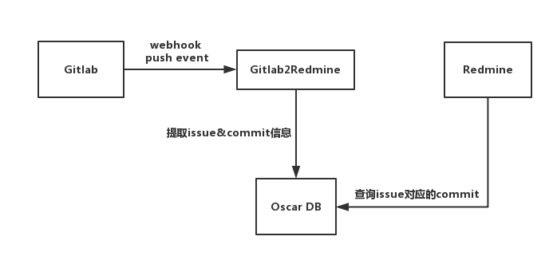

# Gitlab2Redmine

[](https://github.com/Hikyu/gitlab2redmine/blob/master/LICENSE)

1. 什么是 Gitlab webhook？

    Gitlab webhook，即每当Gitlab接收到的push、merge_request（或自定 义的其它操作）事件时，Gitlab会向你指定的url（钩子）发起一个POST请    求。

    服务器端接收请求，检查请求是否合法（如来源，附带的Secret Token，    允许的Git操作等），做一些处理。

    Gitlab2Redmine 就是接收Gitlab Post请求的服务端。

2. 什么是 Gitlab2Redmine

    
    
    Gitlab2Redmine负责监听 Gitlab push 事件，通过解析commit中的提交信息，将issue和对应的commit存入神通数据库。

    同时，Gitlab2Redmine提供Rest服务，Redmine可以通过Gitlab2Redmine提供的Rest API查询指定issue的commit信息。

3. Rest API

    Gitlab2Redmine 可供 Redmine 访问的 rest api 目前只有一条：

    

    详细的API信息，可以通过swagger查看：    `http://IP:PORT/swagger-ui.html`


## Install

```
git clone https://github.com/Hikyu/gitlab2redmine.git
// 安装程序依赖库oscarJDBC和oscarHibernate4
mvn install:install-file -Dfile=lib/oscarJDBC.jar -DgroupId=com.oscar -DartifactId=oscarJDBC -Dversion=1.0.0 -Dpackaging=jar
mvn install:install-file -Dfile=lib/oscarHibernate4.jar -DgroupId=com.oscar -DartifactId=oscarHibernate4 -Dversion=1.0.0 -Dpackaging=jar
// 打包
mvn package
```

打包生成的相关文件位于 target/release 目录下。

## Deployment

### 启动 Gitlab2redmine 服务

进入 target/release 目录:

- 编辑 application.yml 配置文件，配置服务端口和Gitlab api、密钥等信息。

- 执行：

    ```
    nohup java -jar gitlab2redmine.jar &
    ```

    启动服务。

### 配置 Gitlab webhook

1. 使用管理员账户登录Gitlab，点击左侧列表 settings，页面最下方 Outbound requests，勾选 `Allow requests to the local network from hooks and services` 选项。

2. 打开 Gitlab 项目，settings->Integrations， URL 文本框输入 Gitlab2redmine 服务地址，比如：http://192.168.1.70:1219/gitlab/post

   去掉勾选 `Enable SSL verification`

   点击 `Add webhook`

    

    【注】也可以通过执行 WebHookGenerator.java，一次性地为所有的群组内项目添加 Gitlab2redmine 的 webhook。执行前需要修改相应的代码。

## Built With

* [Maven](https://maven.apache.org/) - Dependency Management

## License

This project is licensed under the MIT License - see the [LICENSE.md](LICENSE.md) file for details
